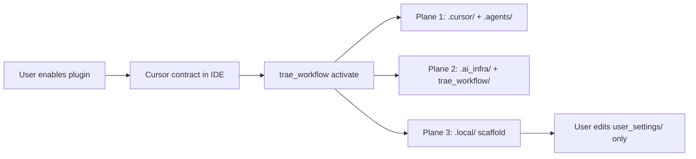

# Cursor Agent Infrastructure Plugin — architecture

**Kit repo map (maintainers):** [repository-map.md](repository-map.md) — SSOT vs generated trees, consumer install surface, deprecated paths. Not shipped to consumer projects.

**Onboarding (by audience):**

| Audience | Read next |
|----------|-----------|
| **Kit maintainer** | [repository-map.md](repository-map.md) → [IMPLEMENTATION-STATUS.md](IMPLEMENTATION-STATUS.md) → [Docs index](../README.md) |
| **Consumer app dev** | [PLUGIN-USER-GUIDE.md](../operations/PLUGIN-USER-GUIDE.md) → [consumer-quickstart.md](../operations/consumer-quickstart.md) → [workflow-architecture.md](../architecture/workflow-architecture.md) |

**Product:** installable **multi-agent workflow infrastructure** for any Cursor project (not a PyPI package, not an MCP-first product).

**User journey:** plugin unpacks the full **consumer infrastructure** → user completes `.local/user_settings/` (GitHub + MCP worksheets) → **`/integrator-mas-agent`** extends agents/skills/MCP while preserving Pattern A, gates, and three-plane layout.

**Optional add-on:** MCP server under `.ai_infra/mcp_servers/` — wraps the same scripts; agents do not require it.

**Expansion path:** after install, use **`/integrator-mas-agent`** to add agents/skills/MCP. Machine checks: `python -m trae_workflow integrate validate` (P0: agent sections, registry parity, pipeline names, user_settings schema). ADR-006 defines MAS-integrated vs independent-governed modes.

---


## Three planes


| Plane           | Path                   | Cursor loads?                      |
| --------------- | ---------------------- | ---------------------------------- |
| Cursor contract | `.cursor/`, `.agents/` | Yes                                |
| Infrastructure  | `.ai_infra/`           | No — scripts and docs reference it |
| Runtime         | `.local/`              | No — gitignored per project        |

---

## Automated activation (three planes on disk)

Enabling the **Marketplace plugin** loads agents/rules/skills into Cursor, but **does not** copy infrastructure into the workspace until activation runs (ADR-001 Option B).



| Step | Who | Command |
|------|-----|---------|
| 1. Enable plugin | Human | Cursor Marketplace |
| 2. Activate planes | Agent or human | `python -m trae_workflow activate --directory .` |
| 3. Personalize | Human | `.local/user_settings/github.collaboration.yaml` |
| 4. Validate | Agent or human | `contributors validate` + `integrate validate` |
| 5. Extend infra | Agent or human | **`/integrator-mas-agent`** in Agent chat (not shell) |

**Source for activate:** plugin `payload/` directory. Set `WORKFLOW_KIT_PAYLOAD=/path/to/payload` when auto-detect fails.

**Agents are not CLI commands.** Names like `integrator-mas-agent` are Cursor subagents — invoke with **`/integrator-mas-agent`** in Agent chat or via parent Agent Task delegation ([Subagents](https://cursor.com/docs/subagents)).

---


## Kit dev repo (where we build the plugin)

```text
mas-workflow-kit/
├── AGENTS.md
├── .cursor-plugin/plugin.json  # marketplace manifest — no path fields (spec-exact discovery)
├── agents/                     # generated (make sync-plugin) — COMMITTED, sibling of .cursor-plugin/
├── rules/                      # generated — COMMITTED
├── skills/                     # generated — COMMITTED
├── payload/                    # generated (ADR-001 install source) — COMMITTED
├── assets/logo.png
├── .cursor/                    # canonical dev source for agents/rules/skills above
├── .agents/                    # maintainer-only slash skills, merged into skills/
├── .ai_infra/              # canonical product tree
│   ├── manifest.yaml
│   ├── paths.py
│   ├── scripts/
│   ├── docs/
│   ├── templates/
│   ├── mcp_servers/        # optional workflow_mcp
│   └── install/trae_workflow/
├── .local/
├── Makefile
├── pyproject.toml         # incl. [tool.pytest.ini_options] — SSOT, no separate pytest.ini
└── tests/
```

Maintainer megadocs live under `.ai_infra/docs/maintainer/` (not copied to consumers).

**`agents/`, `rules/`, `skills/`, `payload/` are generated but MUST be committed to git** — Cursor Marketplace reads the repository tree directly; there is no build step at install/review time. `make check-plugin` guards drift between `.cursor/` + `.agents/skills/` (source of truth) and these generated, committed trees. Upstream [`cursor/plugin-template`](https://github.com/cursor/plugin-template) may include `commands/`, `hooks/`, and repo-root `mcp.json`; **this kit ships** repo-root `agents/`, `rules/`, `skills/`, and `payload/` only (MCP config lives at `.cursor/mcp.json` when enabled). Components are discovered by convention — **no path-override fields** in `plugin.json`.

---


## Installed consumer project (default profile)

```text
my-app/
├── AGENTS.md                 # thin router
├── .cursor/                  # agents, rules, skills
├── .agents/                  # maintainer slash skills
├── .ai_infra/                # slim infrastructure bundle
│   ├── manifest.yaml
│   ├── install-contract.json
│   ├── scripts/pr|architecture|integration|workflow|install/
│   ├── install/trae_workflow/
│   ├── docs/operations|governance|roadmap|decisions|architecture/
│   ├── templates/local-workspace|user-settings|agent-integration/
│   ├── mcp_servers/workflow_mcp/   # with_mcp profile
│   └── workflows/
├── overlays/                 # product rules source (copy → .cursor/rules/)
└── .local/                   # scaffolded trackers
```

**Not installed by default:** kit full `tests/`, `Makefile`, `docs/handoff/`, CI/release scripts, maintainer megadocs under `docs/maintainer/`.

**Kit dev repo only (not in consumer** `.ai_infra/`**):** `scripts/ci/`, `scripts/release/`, `docs/handoff/`, root `Makefile`, full `tests/modules/`. Consumers use the slim bundle from `manifest.yaml` `copy_ai_infra` only.

### `ci/kit-dev` local workspace fixtures

The path `.ai_infra/templates/local-workspace/ci/kit-dev/` holds **kit-repository-only** tracker exemplars (e.g. full `test-index.md` with all `tests/modules/` owners). CI runs `[seed_kit_workspace.py](../../scripts/ci/seed_kit_workspace.py)` before gates because `.local/` is gitignored. **Consumers** receive neutral exemplars under `templates/local-workspace/exemplars/` — not the `ci/kit-dev/` tree. Do not reference `ci/kit-dev` paths in consumer onboarding docs.

---


## Install profiles (`manifest.yaml`)


| Profile    | Adds                                                                             |
| ---------- | -------------------------------------------------------------------------------- |
| `default`  | `.cursor/`, `.agents/`, slim `.ai_infra/`, `.local/` exemplars, `AGENTS.md` stub |
| `with_mcp` | `.ai_infra/mcp_servers/workflow_mcp/`, `requirements-mcp.txt`, `mcp.json`        |


Product rules: copy `overlays/rules/*.mdc` into `.cursor/rules/` after install (not a separate profile).

**Skill merge policy:**

| Tree | Skills source | Purpose |
|------|---------------|---------|
| `skills/` (repo root) | `.cursor/skills/` then additive merge from `.agents/skills/` | Cursor Marketplace loads slash skills from repo-root `skills/` |
| `payload/.cursor/skills/` | **Kit `.cursor/skills/` only** (no maintainer merge) | Consumer disk must not duplicate `.agents/skills/` folder names |
| `payload/.agents/skills/` | Kit `.agents/skills/` | Maintainer PR slash skills on consumer disk |

`sync_plugin_bundle.py` merges `.agents/skills/` into repo-root `skills/` only when the folder name is absent from `.cursor/skills/`. Canonical protocols must never be replaced by maintainer stubs. **Do not** copy merged `skills/` into `payload/.cursor/skills/` — governance `check_governance_consistency.py` fails on duplicate folder names.

---


## Pattern A (unchanged)

- Agents run **one script command** per maintainer action.
- `GATES` hardcoded in `.ai_infra/scripts/pr/prepare.py`.
- Canonical invoke: `python .ai_infra/scripts/pr/prepare.py …`

---


## Plugin vs MCP vs Marketplace


| Mechanism              | What it is                                                          |
| ---------------------- | ------------------------------------------------------------------- |
| **This plugin**        | File bundle installed per project via `trae_workflow activate` or `install` |
| **MCP**                | Optional `.cursor/mcp.json` → `workflow_mcp` tools wrapping scripts |
| **Cursor Marketplace** | Future distribution channel for the same bundle                     |

`.cursor/settings.json` (tracked) is a maintainer kit-dev preference — enables the
`cursor-team-kit` plugin used while authoring this repo. It is not part of the consumer
bundle (not copied by `sync_plugin_bundle.py` or `scaffold.py`) and has no effect on
`trae_workflow activate` output.


Plugins ≠ MCP. This product is agent infrastructure; MCP is an optional wire.

---

## Related docs

| Audience | Document |
|----------|----------|
| **Kit maintainer — repo map** | [repository-map.md](repository-map.md) |
| **Kit maintainer — status** | [IMPLEMENTATION-STATUS.md](IMPLEMENTATION-STATUS.md) |
| **Kit maintainer — publish** | [marketplace-publish.md](marketplace-publish.md) |
| **Kit maintainer — docs index** | [../README.md](../README.md) |
| **Consumer — plugin manual** | [PLUGIN-USER-GUIDE.md](../operations/PLUGIN-USER-GUIDE.md) |
| **Consumer — quickstart** | [consumer-quickstart.md](../operations/consumer-quickstart.md) |
| **Consumer — three planes** | [workflow-architecture.md](../architecture/workflow-architecture.md) |
| **Governance — folder layout** | [folder-charter.md](../governance/folder-charter.md) |
| **`.local/` contract** | [local-workspace-layout.md](../operations/local-workspace-layout.md) |
| **ADR index** | [decisions/README.md](../decisions/README.md) |