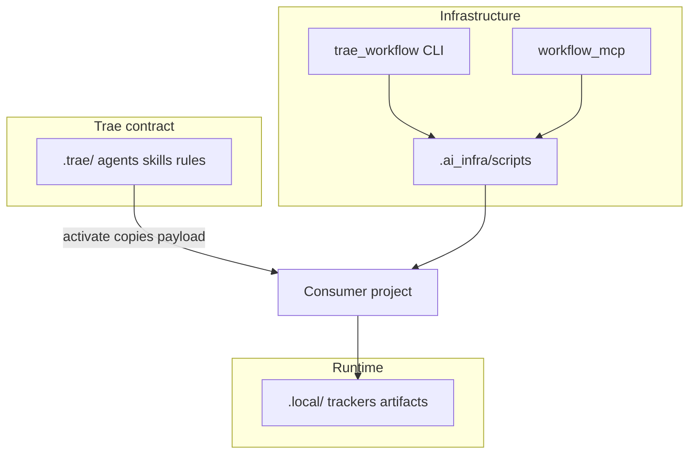

# MAS Workflow Kit for Trae — architecture (kit maintainers)

**Kit repo map:** [repository-map.md](repository-map.md) · **Shipped inventory:** [IMPLEMENTATION-STATUS.md](IMPLEMENTATION-STATUS.md)

**Onboarding:**

| Audience | Read next |
|----------|-----------|
| **Kit maintainer** | [repository-map.md](repository-map.md) → [IMPLEMENTATION-STATUS.md](IMPLEMENTATION-STATUS.md) → [ADR index](../decisions/README.md) |
| **Consumer app dev** | [PLUGIN-USER-GUIDE.md](../operations/PLUGIN-USER-GUIDE.md) → [trae-consumer-quickstart.md](../operations/trae-consumer-quickstart.md) → [workflow-architecture.md](../architecture/workflow-architecture.md) |

**Product:** installable **multi-agent workflow infrastructure** for Trae IDE projects (editable Python package + on-disk three-plane layout — not a Cursor Marketplace plugin).

**User journey:** `pip install -e ".[dev,mcp]"` → `trae_workflow activate --directory .` → configure `.local/user_settings/` → invoke agents via `.trae/rules/agent-<id>.md` or `.trae/skills/`.

> **Upstream Cursor edition:** [mas-workflow-kit](https://github.com/SavinRazvan/mas-workflow-kit) — plugin + `.cursor/` SSOT. See [ADR-009](../decisions/ADR-009-trae-only-edition.md).

---

## Three planes

| Plane | Path | Purpose |
|-------|------|---------|
| Trae contract | `.trae/` | Rules, skills, agents, MCP — **editable SSOT** |
| Infrastructure | `.ai_infra/`, `trae_workflow/` | Scripts, docs, templates, optional MCP server |
| Runtime | `.local/` | Trackers, PR/alignment/drift artifacts (gitignored) |



---

## Activation

```bash
python3 -m trae_workflow activate --directory . --profile default
```

**Profile `default`** ([manifest.yaml](../../manifest.yaml)):

- Copies `payload/.trae/` → `.trae/`
- Copies `trae_workflow/` + slim `.ai_infra/`
- Scaffolds `.local/` tier-1 paths
- Optional `mcp_json: true` → `.trae/mcp.json`

**Parity:** `make sync-plugin` refreshes `payload/.trae/` from committed root `.trae/`; `make check-trae-parity` guards drift.

---

## Agents and skills

| Surface | Count | Location |
|---------|-------|----------|
| Agents | 7 | `.trae/agents/*.md` |
| Skills | 15 | `.trae/skills/*/SKILL.md` |
| Rules | 13 | `.trae/rules/*.md` |

**Invocation (Trae):** ask Trae to follow `.trae/rules/agent-implementer.md` (no slash commands).

**PR workflow hub:** `.trae/skills/pr-workflow/SKILL.md` → `prepare.py` GATES only.

---

## Pattern A (maintainer PR)

1. `review-pr` / `review.py` → `.local/workflow-artifacts/pr/review.md`
2. `prepare-pr` / `prepare.py` → gates + `prep.md`
3. `merge-pr` / `merge.py` + `finalize.py` → `merge.md`

Gate order: **`.ai_infra/scripts/pr/prepare.py`** (`GATES`) — do not duplicate in docs.

---

## MCP (optional)

- Server: `.ai_infra/mcp_servers/workflow_mcp/`
- Registry: `.trae/mcp.registry.yaml`
- Tools wrap scripts — no second GATES implementation

---

## Expansion

Use **integrator-mas-agent** + `.trae/skills/mas-infrastructure-integration/SKILL.md` to add agents/skills/MCP.

Validate: `python3 -m trae_workflow integrate validate --directory .` (INT-001…015).

ADR: [ADR-006](../decisions/ADR-006-agent-integration-model.md)

---

## Kit-dev vs consumer

| Concern | Kit-dev repo | Consumer project |
|---------|--------------|------------------|
| Tests | `tests/modules/` (501) | Optional copy via scaffold |
| Handoff docs | `docs/handoff/` | Not copied |
| `.trae/` | Tracked SSOT | Copied from payload |
| Gates | 4 (kit-dev append) | 2 universal + optional drift |

---

## References

- [folder-charter.md](../governance/folder-charter.md)
- [workflow-source-owners.md](../governance/workflow-source-owners.md)
- [local-workspace-layout.md](../operations/local-workspace-layout.md)
