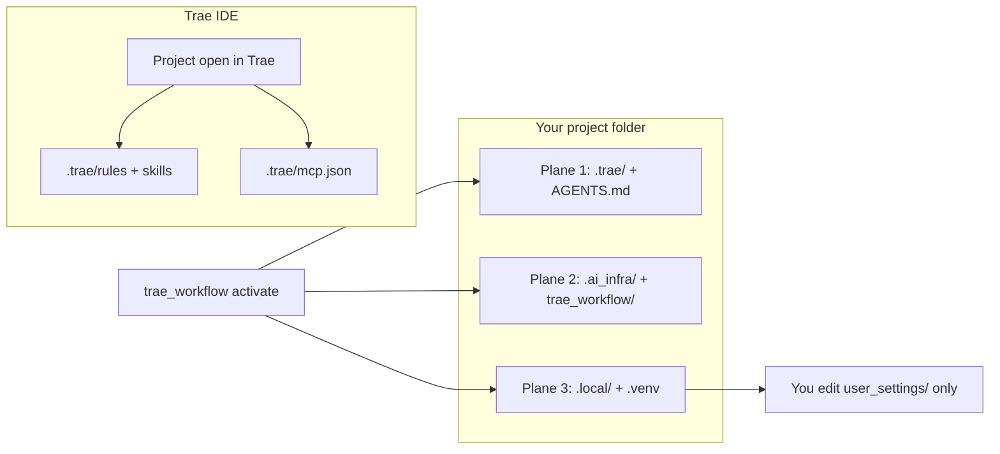

<!--
File: PLUGIN-USER-GUIDE.md
Path: .ai_infra/docs/operations/PLUGIN-USER-GUIDE.md
Role: Unified consumer manual for the Trae edition — activate, use cases, file tree.
Used By:
 - README.md
 - AGENTS.md (stub)
 - trae-consumer-quickstart.md
Depends On:
 - .ai_infra/manifest.yaml
 - .ai_infra/install-contract.json
 - .ai_infra/docs/decisions/ADR-009-trae-only-edition.md
Notes:
 - Copied to consumer projects via manifest copy_ai_infra: docs/operations.
 - Cursor Marketplace edition: upstream mas-workflow-kit (separate repo).
-->

# MAS Workflow Kit for Trae — User Guide

Single entry point for **activating** and **using** the kit in your project with **Trae IDE**. Deeper runbooks are linked as chapters — you do not need the kit maintainer repo open.

> **Cursor edition:** upstream [mas-workflow-kit](https://github.com/SavinRazvan/mas-workflow-kit) uses `/add-plugin` and `.cursor/`. This repository is **Trae-only**.

---

## 1. Activate vs three planes

Trae has no plugin marketplace step. **Activate** copies infrastructure into your open workspace from terminal:

```bash
python3 -m trae_workflow activate --directory . --profile default
```



| Plane | Paths | Trae sees? | Purpose |
|-------|-------|-----------|---------|
| **Trae contract** | `.trae/`, `AGENTS.md` | Yes | Agent rules, skills, MCP config |
| **Infrastructure** | `.ai_infra/`, `trae_workflow/` | No | Scripts, docs, templates, optional MCP server |
| **Runtime** | `.local/`, `.venv` | No | Trackers, dashboards, user settings (gitignored) |

**Important:** Open **your app folder** in Trae, run activate from terminal once (safe to re-run — idempotent). Enable **Include AGENTS.md** in Trae AI settings.

Shorter path: [trae-consumer-quickstart.md](trae-consumer-quickstart.md).

---

## 2. Quick start (4 steps)

**Need:** Trae IDE · Python 3.11+ · **your project** open (not `mas-workflow-kit-trae` kit-dev unless developing the kit).

| Step | Action |
|------|--------|
| 1. Venv + install | `pip install -e ".[dev,mcp]"` (or use kit payload after clone) |
| 2. Activate | `python3 -m trae_workflow activate --directory . --profile default` → wait for **`VERIFY PASS`** |
| 3. Your name | Edit `.local/user_settings/github.collaboration.yaml` → `python3 -m trae_workflow contributors validate` |
| 4. Build | Ask Trae to follow `.trae/rules/agent-implementer.md` · read `session-pointer.md` → `plan.md` → `work-tracker.md` |

**Trae settings:** Include AGENTS.md · confirm `.trae/rules/` and `.trae/skills/` load · connect **workflow-kit** MCP from `.trae/mcp.json`.

---

## 3. What lands on disk after activate

From `manifest.yaml` (profile **`default`**):

```text
your-project/
├── AGENTS.md                      # thin router (not overwritten on re-activate)
├── .trae/
│   ├── agents/                    # 7 agent prompts
│   ├── skills/                    # protocols (activate, audit, PR, integration, …)
│   ├── rules/                     # governance + agent-requested rules
│   └── mcp.json                   # workflow-kit MCP
├── .ai_infra/
│   ├── manifest.yaml
│   ├── install-contract.json
│   ├── scripts/pr|architecture|integration|workflow|install/
│   ├── install/trae_workflow/     # CLI package
│   ├── docs/operations|governance|roadmap|decisions|architecture/
│   ├── templates/local-workspace|user-settings|agent-integration/
│   ├── mcp_servers/workflow_mcp/
│   └── workflows/
├── .local/                        # trackers, dashboards (gitignored)
│   ├── index-and-planning/current/
│   ├── user_settings/             # YOU edit these
│   └── agents-control-center/
├── trae_workflow/                 # python3 -m trae_workflow shim
├── .venv/                         # created on activate
└── tests/modules/smoke/           # install smoke test only
```

**Not installed:** kit full `tests/`, `Makefile`, `docs/handoff/`, CI/release scripts. Those exist only in the [kit repository](https://github.com/SavinRazvan/mas-workflow-kit-trae).

**Re-activate is safe:** existing trackers, `user_settings/`, and `AGENTS.md` are not overwritten. Kit-managed **dashboard HTML**, JS/CSS, `module-audit.html`, and `pages.json` **are refreshed** on each activate.

---

## 4. Trae chat vs terminal

| Where | Use for |
|-------|---------|
| **Trae chat** | Follow agent rules/skills; attach `@` context |
| **Terminal** | `python3 -m trae_workflow …`, pytest, PR scripts, serving dashboards |

Trae has **no slash subagents**. Invoke kit agents explicitly:

| Goal | Trae chat | Disk path |
|------|-----------|-----------|
| Activate / refresh | Terminal: `python3 -m trae_workflow activate --directory .` | `.trae/skills/workflow-activate/` |
| Implement | Follow `agent-implementer` rule | `.trae/rules/agent-implementer.md` |
| Tests | Follow `agent-test-runner` rule | `.trae/rules/agent-test-runner.md` |
| PR lifecycle | Skills in order (see §8) | `.trae/skills/review-pr/`, `prepare-pr/`, `merge-pr/` |
| Extend kit | Follow `agent-integrator-mas-agent` | `.trae/skills/mas-infrastructure-integration/` |
| External MCP | Follow `connect-external-mcp` skill | `.trae/skills/connect-external-mcp/` |

**Suggested chat prompt:**

```text
Follow the agent-implementer rule in .trae/rules/ and read session-pointer.md first.
```

### Terminal commands (project root)

```bash
cd ~/Projects/my-app
source .venv/bin/activate
```

| Command | Purpose |
|---------|---------|
| `python3 -m trae_workflow activate --directory . --profile default` | Install, re-activate, refresh dashboards |
| `python3 -m trae_workflow contributors validate` | After editing collaboration YAML |
| `python3 -m trae_workflow health` | Layout + version |
| `python3 -m trae_workflow integrate validate` | Integration checks |
| `python3 -m trae_workflow gates` | Full smoke gates |
| `python3 -m trae_workflow drift validate --profile consumer` | Consumer drift — see [trae-consumer-quickstart](trae-consumer-quickstart.md) |
| `python3 -m pytest -q tests/modules/smoke/` | Install smoke |

---

## 5. Control Center dashboards

Local browser UI for trackers and docs under `.local/agents-control-center/`.

**Do not open HTML via `file://`** — browsers block fetch. From project root:

```bash
python3 -m http.server 8000
```

**Open:** http://localhost:8000/.local/agents-control-center/dashboards/index.html

Refresh after kit update: `python3 -m trae_workflow activate --directory .`

---

## 6. Use-case matrix

| I want to… | Trae | Terminal | Deep dive |
|------------|------|----------|-----------|
| **First-time setup** | Enable AGENTS.md + rules | `activate --profile default` | [workflow-activate skill](../../../.trae/skills/workflow-activate/SKILL.md) |
| **Implement a feature slice** | `agent-implementer` rule | — | [implementation-execution-loop](../../../.trae/skills/implementation-execution-loop/SKILL.md) |
| **Run tests / coverage** | `agent-test-runner` rule | `pytest -q` | [workflow-complete.md](workflow-complete.md) §C |
| **Verify a claim** | `agent-verifier` rule | — | Evidence-only checks |
| **Architecture audit** | `agent-enterprise-auditor` rule | — | [agent-workflow-procedures.md](agent-workflow-procedures.md) §1 |
| **Operational drift** | `agent-workflow-drift-guard` rule | `drift validate --profile consumer` | [ADR-007](../decisions/ADR-007-workflow-drift-guard.md) |
| **PR: review → prepare → merge** | Skills §8 | `prepare.py` GATES | [workflow-complete.md](workflow-complete.md) §A |
| **Add agents / skills / MCP** | `agent-integrator-mas-agent` | `integrate validate` | [mas-infrastructure-integration.md](mas-infrastructure-integration.md) |
| **Connect external MCP** | `connect-external-mcp` skill | edit `mcp.agents.yaml` | [connect-external-mcp.md](connect-external-mcp.md) |
| **Upgrade / refresh** | Re-open project | `activate --directory .` | [upgrade-kit.md](upgrade-kit.md) |
| **Check install health** | — | `python3 -m trae_workflow health` | [gate-matrix.md](gate-matrix.md) |

### Kit agents and skills (disk)

| Id | Rules | Agents | Skills |
|----|-------|--------|--------|
| implementer | `.trae/rules/agent-implementer.md` | `.trae/agents/implementer.md` | implementation-execution-loop |
| test-runner | agent-test-runner | `.trae/agents/test-runner.md` | test-module-coverage |
| verifier | agent-verifier | `.trae/agents/verifier.md` | — |
| enterprise-auditor | agent-enterprise-auditor | `.trae/agents/enterprise-auditor.md` | enterprise-architecture-audit |
| workflow-drift-guard | agent-workflow-drift-guard | `.trae/agents/workflow-drift-guard.md` | workflow-drift-audit |
| researcher | agent-researcher | `.trae/agents/researcher.md` | research-corpus-execution |
| integrator-mas-agent | agent-integrator-mas-agent | `.trae/agents/integrator-mas-agent.md` | mas-infrastructure-integration |

PR maintainer skills: `.trae/skills/review-pr/`, `prepare-pr/`, `merge-pr/`, `pr-workflow/`.

---

## 7. Daily workflow

Every session:

1. `.local/index-and-planning/current/session-pointer.md`
2. `plan.md` → `work-tracker.md`
3. Follow **`agent-implementer`** (or specialist from §6)
4. Optional: [Control Center dashboards](#5-control-center-dashboards)

Token contract: [token-efficiency.md](token-efficiency.md) · Layout: [local-workspace-layout.md](local-workspace-layout.md).

---

## 8. PR lifecycle (summary)

Pattern A — one script command per step; gate order lives only in `prepare.py`.

1. Feature branch (`feature/`, `fix/`, `chore/`)
2. Implement + test → follow `.trae/skills/review-pr/SKILL.md` (or `review.py`)
3. `.trae/skills/prepare-pr/SKILL.md` (runs `prepare.py` GATES)
4. `.trae/skills/merge-pr/SKILL.md` → sync `main`, delete branch

Full checklist: [workflow-complete.md](workflow-complete.md).

---

## 9. Architecture audit (summary)

For architecture-impacting work before merge prep:

1. Follow **`agent-enterprise-auditor`** + `.trae/skills/enterprise-architecture-audit/SKILL.md`
2. Outputs under `.local/workflow-artifacts/enterprise-architecture-audit/`
3. Focused PR pass may write `.local/workflow-artifacts/alignment/` instead

Procedure: [agent-workflow-procedures.md](agent-workflow-procedures.md).

---

## 10. Personalize settings

| File | Purpose |
|------|---------|
| `.local/user_settings/github.collaboration.yaml` | Commit trailers + PR artifact headers (**required**) |
| `.local/user_settings/mcp.agents.yaml` | Per-agent MCP attachments (optional) |

```bash
python3 -m trae_workflow contributors validate   # must PASS before first PR
python3 -m trae_workflow integrate validate      # P0 must be 0
python3 -m trae_workflow health
```

Use project `.venv`: `source .venv/bin/activate` before CLI commands.

---

## 11. Verify and gates

| Command | When | Steps |
|---------|------|-------|
| `python3 -m trae_workflow gates` | Post-change smoke | **5** base; **6** on kit-dev when `.trae/` present (adds trae parity) |
| `scaffold --verify` | Consumer post-install | **4** (no doc facts, no trae parity) |
| `python3 -m trae_workflow health` | Anytime | Layout + version |
| `python3 -m trae_workflow drift validate` | Slice closure (kit-dev) | Plan ↔ tracker coherence |
| `python3 -m trae_workflow drift validate --profile consumer` | Consumer verify | DRIFT-005 + DRIFT-008 only |

Details: [gate-matrix.md](gate-matrix.md). **`make gates`** is **kit maintainer only** (this repo).

---

## 12. Troubleshooting

| Problem | Fix |
|---------|-----|
| `.trae/` missing after clone | Run `activate --profile default` from project root |
| Rules/skills not loading | Open **your activated project** in Trae; reload window |
| `contributors validate` FAIL | Replace placeholders in `github.collaboration.yaml` |
| `pytest` not found | Re-run activate (creates `.venv`); use `source .venv/bin/activate` |
| Activate blocked in kit repo | Open your app folder — activate refuses self-install on consumer guard |
| Control Center **Failed to fetch** | `python3 -m http.server 8000` from project root — not `file://` |
| MCP not loading | Check `.trae/mcp.json`; `mcp validate`; reload Trae window |
| `mcp validate` → typer required | Use `python3 -m trae_workflow mcp validate` |

More: [trae-consumer-quickstart.md](trae-consumer-quickstart.md) § Troubleshooting.

---

## 13. Further reading

| Topic | Doc |
|-------|-----|
| All runbooks | [operations README](README.md) |
| Three-plane architecture | [workflow-architecture.md](../architecture/workflow-architecture.md) |
| Why activate + payload | [ADR-001](../decisions/ADR-001-distribution-activation.md) · [ADR-009](../decisions/ADR-009-trae-only-edition.md) |
| Upgrade / semver | [upgrade-kit.md](upgrade-kit.md) |
| Optional project metadata | [project-config.md](project-config.md) |

**Kit maintainers** (not copied to your project): `docs/handoff/` in the [GitHub kit repo](https://github.com/SavinRazvan/mas-workflow-kit-trae/tree/main/.ai_infra/docs/handoff).
