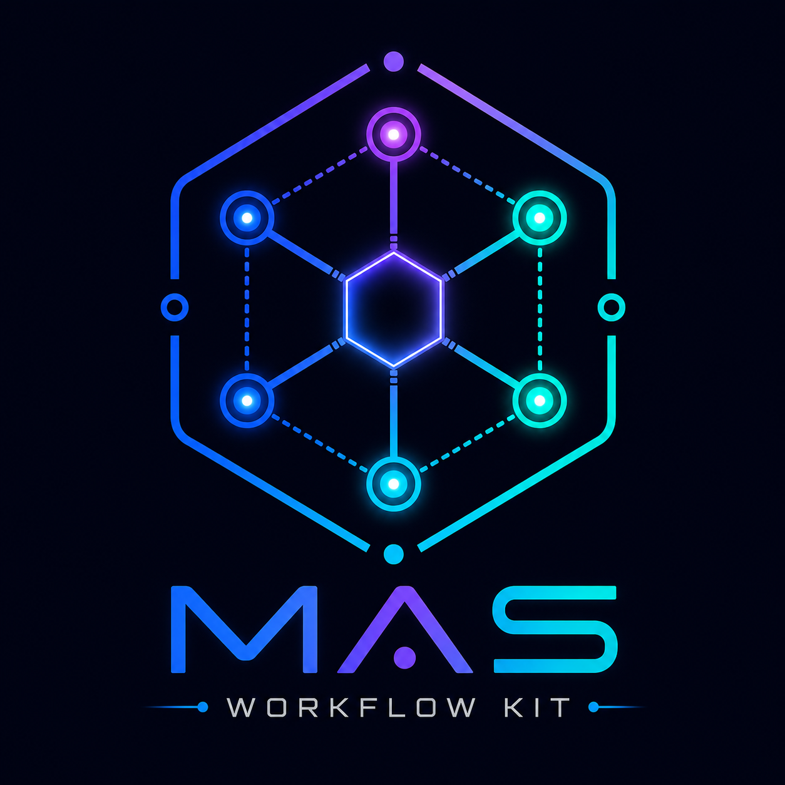
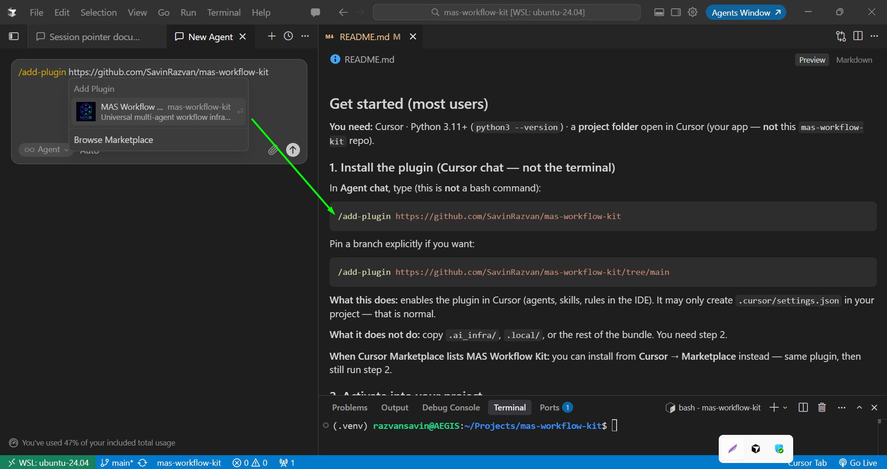

<p align="center">
  
</p>

<p align="center">
  Multi-agent workflow for Cursor — subagents, skills, rules, PR scripts, and <code>.local/</code> trackers.<br>
  Install into <strong>your</strong> project (not a standalone app).
</p>

## Quick navigation

- **New user** — [Get started in 4 steps](#get-started-most-users)
- **Plugin manual** — [PLUGIN-USER-GUIDE](.ai_infra/docs/operations/PLUGIN-USER-GUIDE.md) (architecture, file tree, use cases)
- **Chat + terminal commands** — [Consumer quickstart](.ai_infra/docs/operations/consumer-quickstart.md) (install, dashboards, verify)
- **Kit maintainer** — [Developing the kit](#developing-the-kit-repo-only) · [Docs index](.ai_infra/docs/README.md) · [Repository map](.ai_infra/docs/handoff/repository-map.md) · [Plugin architecture](.ai_infra/docs/handoff/PLUGIN-ARCHITECTURE.md)

---


## Get started (most users)

**You need:** Cursor · Python 3.11+ (`python3 --version`) · a **project folder** open in Cursor (your app — **not** this `mas-workflow-kit` repo).

### 1. Install the plugin (Cursor chat — not the terminal)

In **Agent chat**, type (this is **not** a bash command):

```text
/add-plugin https://github.com/SavinRazvan/mas-workflow-kit
```

Cursor shows an **Add Plugin** preview — click the **MAS Workflow Kit** card to install:



Pin a branch explicitly if you want:

```text
/add-plugin https://github.com/SavinRazvan/mas-workflow-kit/tree/main
```

**What this does:** enables the plugin in Cursor (agents, skills, rules in the IDE). It may only create `.cursor/settings.json` in your project — that is normal.

**What it does not do:** copy `.ai_infra/`, `.local/`, or the rest of the bundle. You need step 2.

**When Cursor Marketplace lists MAS Workflow Kit:** you can install from **Cursor → Marketplace** instead — same plugin, then still run step 2.

### 2. Activate into your project

1. **File → Open Folder** → your app (create a folder first if needed, e.g. `~/Projects/my-app`)
2. In **Agent chat**, type (this is **not** a bash command):

```text
/workflow-activate
```

Or type `/` and pick **workflow-activate** from the menu.

3. Wait for `VERIFY PASS: all gates green` and all planes **ready**

Activate copies the full bundle into that folder: `.cursor/`, `.agents/`, `.ai_infra/`, `.local/`, `cursor_workflow/`, and `AGENTS.md`.

### 3. Add your name (~1 min)

Open `.local/user_settings/github.collaboration.yaml` in **the same project folder** from step 2 and replace:

```yaml
owner:
  display_name: "Your Full Name"    # → your real name
  github_user: "@yourhandle"        # → e.g. @SavinRazvan
```

From **that project folder** (not the kit repo):

```bash
source .venv/bin/activate          # activate creates .venv on first run
python3 -m cursor_workflow contributors validate
python3 -m cursor_workflow health
python3 -m cursor_workflow integrate validate   # P0 must be 0
```

Expected: `contributors validate: PASS`. Run the last two anytime to confirm a healthy install.

> **YAML tip:** Only change `owner.display_name` and `owner.github_user` at first. Leave commented `# - display_name:` examples commented — uncommenting them under `human_coauthors: []` breaks the file.


### 4. Start building

Type `/` in Agent chat — Cursor lists **subagents**, **skills**, and **commands** in one menu ([Customize](https://cursor.com/docs/customize-cursor)). Use `@` only to attach files, docs, or git context — not to start kit workflows ([Prompting](https://cursor.com/docs/agent/prompting)).


| Do this                     | Type in chat                                                |
| --------------------------- | ----------------------------------------------------------- |
| Implement a feature         | `/implementer`                                              |
| Run tests / coverage        | `/test-runner`                                              |
| Verify claims               | `/verifier`                                                 |
| Architecture audit          | `/enterprise-auditor`                                       |
| Operational drift           | `/workflow-drift-guard`                                     |
| Add agents / skills / MCP   | `/integrator-mas-agent` + `/mas-infrastructure-integration` |
| Connect external MCP        | `/connect-external-mcp` (after editing `mcp.agents.yaml`)   |
| PR review → prepare → merge | `/review-pr` → `/prepare-pr` → `/merge-pr`                  |


Each session, read first: `.local/index-and-planning/current/session-pointer.md` → `plan.md` → `work-tracker.md`

### 5. Optional — Control Center dashboards

Browse trackers and docs in your browser. **Do not** open HTML via `file://` — use a local server:

```bash
cd ~/Projects/my-app    # your activated project
python3 -m http.server 8000
```

**Open in browser:** http://localhost:8000/.local/agents-control-center/dashboards/index.html

*(Port busy? Use `8001` — or any free port — and swap the port in the URL.)*


| Page           | URL                                                                                                                                                                                                  |
| -------------- | ---------------------------------------------------------------------------------------------------------------------------------------------------------------------------------------------------- |
| Home           | [http://localhost:8000/.local/agents-control-center/dashboards/index.html](http://localhost:8000/.local/agents-control-center/dashboards/index.html)                                                 |
| Control Center | [http://localhost:8000/.local/agents-control-center/dashboards/implementation-control-center.html](http://localhost:8000/.local/agents-control-center/dashboards/implementation-control-center.html) |
| Module audit   | [http://localhost:8000/.local/agents-control-center/audits/module-audit.html](http://localhost:8000/.local/agents-control-center/audits/module-audit.html)                                           |


After a kit update, refresh dashboards: `/workflow-activate` in chat or `python3 -m cursor_workflow activate --directory .`

Full reference: [consumer quickstart](.ai_infra/docs/operations/consumer-quickstart.md) · [PLUGIN-USER-GUIDE](.ai_infra/docs/operations/PLUGIN-USER-GUIDE.md)

**Consumer drift:** On app projects use `drift validate --profile consumer` (no agent required). If **DRIFT-005 FAIL** mentions missing `IMPLEMENTATION-STATUS.md`, that is a **kit bug (not your app)** — see [consumer quickstart § DRIFT-005](.ai_infra/docs/operations/consumer-quickstart.md#drift-005-fail--kit-bug-not-your-app).

---

**Commands cheat sheet (agent chat vs terminal)**

**Agent chat** (type `/` — not bash):


| Goal               | Command                                                       |
| ------------------ | ------------------------------------------------------------- |
| Install plugin     | `/add-plugin https://github.com/SavinRazvan/mas-workflow-kit` |
| Activate / refresh | `/workflow-activate`                                          |
| Implement          | `/implementer`                                                |
| PR workflow        | `/review-pr` → `/prepare-pr` → `/merge-pr`                    |


**Terminal** (from your project, after `source .venv/bin/activate`):

```bash
python3 -m cursor_workflow contributors validate   # after YAML edit
python3 -m cursor_workflow health
python3 -m cursor_workflow integrate validate
python3 -m cursor_workflow gates
python3 -m cursor_workflow drift validate --profile consumer   # consumer apps — no agent required
python3 -m cursor_workflow activate --directory .    # re-activate / refresh dashboards
python3 -m http.server 8000
# Open: http://localhost:8000/.local/agents-control-center/dashboards/index.html
```


---


### Quick tips (common mistakes)


| Do                                                                                              | Don't                                                                              |
| ----------------------------------------------------------------------------------------------- | ---------------------------------------------------------------------------------- |
| Open **your app** in Cursor before `/workflow-activate`                                         | Activate while inside `mas-workflow-kit`                                           |
| Install plugin in **Agent chat**: `/add-plugin https://github.com/SavinRazvan/mas-workflow-kit` | Run `/add-plugin` in the terminal — it is chat-only                                |
| Expect only `.cursor/settings.json` until `/workflow-activate`                                  | Expect the full bundle after `/add-plugin` alone                                   |
| Run CLI from **your activated project**                                                         | Run `contributors validate` from the kit repo — it checks the wrong folder         |
| Run `pytest tests/modules/smoke/` after activate/install                                        | Run it from the kit repo — that folder only exists in activated/installed projects |
| `source .venv/bin/activate` then `python3 -m cursor_workflow …`                                 | Use system `python3` for `gates` without venv — pytest may be missing              |
| Serve dashboards: `python3 -m http.server 8000` then open `http://localhost:8000/.local/agents-control-center/dashboards/index.html` | Open dashboard HTML via `file://` — fetch is blocked |
| Type `/` and pick subagents/skills                                                              | Use `@ implementer` — `@` is for file/doc context only                             |
| Create a **real** project folder (e.g. `~/Projects/my-app`)                                     | Copy `/path/to/your-project` or `cd` to a folder that does not exist               |
| Ignore `make …` in this repo                                                                    | Run maintainer commands unless you develop the kit                                 |


**Alternative: terminal activate (no plugin UI)**

Use this if `/add-plugin` is unavailable or you prefer CLI-only setup:

```bash
export KIT=~/Projects/mas-workflow-kit
export TARGET=~/Projects/my-app
mkdir -p "$TARGET"

"$KIT/.venv/bin/python" "$KIT/payload/cursor_workflow" activate \
  --directory "$TARGET" --source "$KIT/payload"
cd "$TARGET"
source .venv/bin/activate
```


---


## What you get

After activate, your project includes:


| Piece                     | Count              | Where                                                                                                                              |
| ------------------------- | ------------------ | ---------------------------------------------------------------------------------------------------------------------------------- |
| **Subagents**             | 7                  | `.cursor/agents/` — implementer, test-runner, verifier, enterprise-auditor, integrator-mas-agent, workflow-drift-guard, researcher |
| **Skills**                | 10                 | `.cursor/skills/` — workflow-activate, implementation loop, tests, audits, integration, MCP, …                                     |
| **PR skills**             | 5                  | `.agents/skills/` — review-pr, prepare-pr, merge-pr, pr-workflow, audit-alignment (deprecated stub → enterprise-auditor)           |
| **6 universal rules**     | 6                  | `.cursor/rules/` — always-on governance                                                                                            |
| **PR scripts**            | Pattern A          | `.ai_infra/scripts/pr/` — review → prepare → merge                                                                                 |
| **Trackers + dashboards** | Tier 1 scaffold    | `.local/index-and-planning/`, `.local/agents-control-center/`                                                                      |
| **CLI**                   | one entrypoint     | `python3 -m cursor_workflow` — activate, gates, health, integrate, drift, doc, verify, …                                           |
| **Onboarding doc**        | copied on activate | `AGENTS.md` + `consumer-quickstart.md` under `.ai_infra/docs/operations/`                                                          |


Optional product rules: [overlays/rules/](overlays/README.md)

**Verify anytime** (from **your activated project** — e.g. `~/Projects/my-app` — not the `mas-workflow-kit` kit repo; `tests/modules/smoke/` only exists after activate/install):

```bash
cd ~/Projects/my-app
source .venv/bin/activate    # or: .venv/bin/python -m cursor_workflow …
python3 -m cursor_workflow health
python3 -m cursor_workflow integrate validate
python3 -m cursor_workflow gates
python3 -m pytest -q tests/modules/smoke/
```

---


## Git / PR workflow (when you use git)

1. Create a branch (`feature/…`, `fix/…`, or `chore/…`)
2. Work with `/implementer`; trackers live in `.local/index-and-planning/current/`
3. In Agent chat: `/review-pr` → `/prepare-pr` → `/merge-pr` (skills under `.agents/skills/`)
4. Architecture-impacting changes: `/enterprise-auditor` before prepare (alignment artifacts)

Scripts (Pattern A — one command per phase): `python .ai_infra/scripts/pr/prepare.py --pr <url> --pipeline default` when not using chat skills.

Details after activate: `AGENTS.md` and [consumer quickstart](.ai_infra/docs/operations/consumer-quickstart.md).

---


## Advanced install (git clone, no plugin)

If you cannot use `/add-plugin`, clone and install directly:

```bash
git clone https://github.com/SavinRazvan/mas-workflow-kit.git
cd mas-workflow-kit && python3 -m venv .venv
.venv/bin/pip install -q -r requirements-dev.txt

export TARGET=~/Projects/my-app && mkdir -p "$TARGET"
.venv/bin/python -m cursor_workflow install \
  --target "$TARGET" --with-venv --with-mcp-json --verify
cd "$TARGET" && source .venv/bin/activate
```

Then continue from [step 3](#3-add-your-name-1-min) above. Preview: add `--dry-run`. See [install dry-run](.ai_infra/docs/operations/install-dry-run.md).

---


## Developing the kit repo only

> **Consumers:** you can ignore this section.

The `.local/` tree you see in **this** repo's source (`mas-workflow-kit`) is a versioned CI
seed fixture used to test the kit's own gates — it is not what you get as a consumer. When you
run `/workflow-activate` in your own project, you receive **neutral exemplars** (placeholders
like `Your Full Name`) instead, scaffolded fresh from `.ai_infra/templates/`. Don't copy this
repo's `.local/` content into your project.

```bash
python3 -m venv .venv && .venv/bin/pip install -e ".[dev,mcp]"
make gates && make smoke-consumer && make sync-plugin && make check-plugin
```

**Kit maintainer docs:** [Docs index](.ai_infra/docs/README.md) · [IMPLEMENTATION-STATUS](.ai_infra/docs/handoff/IMPLEMENTATION-STATUS.md) · [Repository map](.ai_infra/docs/handoff/repository-map.md) · [Plugin architecture](.ai_infra/docs/handoff/PLUGIN-ARCHITECTURE.md) · [Marketplace / versioning](.ai_infra/docs/handoff/marketplace-publish.md)

## License

Apache 2.0 — [LICENSE](LICENSE) · [NOTICE](NOTICE)
