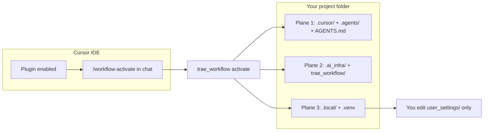

<!--
File: PLUGIN-USER-GUIDE.md
Path: .ai_infra/docs/operations/PLUGIN-USER-GUIDE.md
Role: Unified consumer-facing plugin manual — install, activate, use cases, file tree.
Used By:
 - README.md
 - AGENTS.md (stub)
 - consumer-quickstart.md
Depends On:
 - .ai_infra/manifest.yaml
 - .ai_infra/install-contract.json
 - .ai_infra/docs/decisions/ADR-001-distribution-activation.md
Notes:
 - Copied to consumer projects via manifest copy_ai_infra: docs/operations.
-->

# MAS Workflow Kit — Plugin User Guide

Single entry point for **installing**, **activating**, and **using** the kit in your project. Deeper runbooks are linked as chapters — you do not need the kit maintainer repo open.

---

## 1. Plugin vs activate vs three planes

Two things happen at different times:

| Stage | What changes | Where |
|-------|--------------|-------|
| **Install plugin** | Cursor loads agents, skills, rules from the plugin bundle | **IDE only** — nothing written to your project folder yet |
| **Activate** (`/workflow-activate`) | Copies infrastructure + trackers into your open workspace | **Your project on disk** |



| Plane | Paths | Cursor sees? | Purpose |
|-------|-------|--------------|---------|
| **Cursor contract** | `.cursor/`, `.agents/`, `AGENTS.md` | Yes | Agents, skills, rules, MCP config |
| **Infrastructure** | `.ai_infra/`, `trae_workflow/` | No | Scripts, docs, templates, optional MCP server |
| **Runtime** | `.local/`, `.venv` | No | Trackers, dashboards, user settings (gitignored) |

**Important:** Enabling the plugin does **not** replace activate. Open **your app folder** in Cursor, then run **`/workflow-activate`** once (safe to re-run — idempotent).

### Install plugin from GitHub (recommended until Marketplace listing)

In **Agent chat** (not the terminal):

```text
/add-plugin https://github.com/SavinRazvan/mas-workflow-kit
```

Cursor shows an **Add Plugin** preview — click the **MAS Workflow Kit** card to install:


Optional — explicit branch:

```text
/add-plugin https://github.com/SavinRazvan/mas-workflow-kit/tree/main
```

This loads agents, skills, and rules into Cursor. Your project may only get `.cursor/settings.json` until you activate (§2).

**When listed:** **Cursor → Marketplace → MAS Workflow Kit → Install** — same two-step flow; you still run **`/workflow-activate`** afterward.

### Trae (parallel IDE, no plugin)

Trae has no `/add-plugin`. Use **`--profile default`** on activate to install `.trae/` alongside `.cursor/`. Full runbook: [trae-consumer-quickstart.md](trae-consumer-quickstart.md) ([ADR-008](../decisions/ADR-008-dual-ide-contract-plane.md)).

```bash
python3 -m trae_workflow activate --directory . --profile default
```

Enable **Include AGENTS.md** in Trae settings. One IDE should own the active slice in `.local/` at a time.

---

## 2. Quick start (4 steps)

**Need:** Cursor · Python 3.11+ · **your project** open (not `mas-workflow-kit`).

| Step | Action |
|------|--------|
| 1. Plugin | Agent chat: `/add-plugin https://github.com/SavinRazvan/mas-workflow-kit` *(or Marketplace when listed)* |
| 2. Activate | Open **your app** → Agent chat → **`/workflow-activate`** → wait for **`VERIFY PASS`** and all planes **ready** |
| 3. Your name | Edit `.local/user_settings/github.collaboration.yaml` → `python3 -m trae_workflow contributors validate` |
| 4. Build | **`/implementer`** · read `session-pointer.md` → `plan.md` → `work-tracker.md` |

**Step 2 — in Agent chat (not the terminal):**

```text
/workflow-activate
```

Shorter variant: [consumer-quickstart.md](consumer-quickstart.md).

---

## 3. What lands on disk after activate

From `manifest.yaml` (default profile **`with_mcp`**):

```text
your-project/
├── AGENTS.md                      # thin router (not overwritten on re-activate)
├── .cursor/
│   ├── agents/                    # 7 subagents
│   ├── skills/                    # protocols (activate, audit, integration, …)
│   ├── rules/                     # always-applied governance
│   └── mcp.json                   # with_mcp profile
├── .agents/skills/                # maintainer slash skills (/review-pr, …)
├── .ai_infra/
│   ├── manifest.yaml
│   ├── install-contract.json
│   ├── scripts/pr|architecture|integration|workflow|install/
│   ├── install/trae_workflow/   # CLI package
│   ├── docs/operations|governance|roadmap|decisions|architecture/
│   ├── templates/local-workspace|user-settings|agent-integration/
│   ├── mcp_servers/workflow_mcp/  # with_mcp profile
│   └── workflows/
├── .local/                        # trackers, dashboards (gitignored)
│   ├── index-and-planning/current/
│   ├── user_settings/             # YOU edit these
│   └── agents-control-center/
├── trae_workflow/               # python3 -m trae_workflow shim
├── .venv/                         # created on activate
└── tests/modules/smoke/           # install smoke test only
```

**Not installed:** kit full `tests/`, `Makefile`, `docs/handoff/`, CI/release scripts, maintainer megadocs. Those exist only in the [kit repository](https://github.com/SavinRazvan/mas-workflow-kit).

**Re-activate is safe:** existing trackers, `user_settings/`, and `AGENTS.md` are not overwritten. Kit-managed **dashboard HTML**, JS/CSS, `module-audit.html`, and `pages.json` **are refreshed** on each activate.

---

## 4. Agent chat vs terminal

| Where | Use for |
|-------|---------|
| **Agent chat** (`/` menu) | Plugin install, activate, subagents, skills, PR slash workflow |
| **Terminal** | `python3 -m trae_workflow …`, pytest, serving dashboards |

### Agent chat commands

| Goal | Type in chat |
|------|--------------|
| Install plugin | `/add-plugin https://github.com/SavinRazvan/mas-workflow-kit` |
| Activate / refresh | `/workflow-activate` |
| Implement | `/implementer` |
| Tests | `/test-runner` |
| PR lifecycle | `/review-pr` → `/prepare-pr` → `/merge-pr` |
| Extend kit | `/integrator-mas-agent` |

### Terminal commands (project root)

```bash
cd ~/Projects/my-app
source .venv/bin/activate
```

| Command | Purpose |
|---------|---------|
| `python3 -m trae_workflow activate --directory .` | Install, re-activate, refresh dashboards |
| `python3 -m trae_workflow contributors validate` | After editing collaboration YAML |
| `python3 -m trae_workflow health` | Layout + version |
| `python3 -m trae_workflow integrate validate` | Integration checks |
| `python3 -m trae_workflow gates` | Full smoke gates |
| `python3 -m trae_workflow drift validate --profile consumer` | Consumer drift (no agent required) — see [consumer-quickstart](consumer-quickstart.md#drift-on-consumer-apps) |
| `python3 -m pytest -q tests/modules/smoke/` | Install smoke |

Full list: [consumer-quickstart.md](consumer-quickstart.md) § Terminal commands cheat sheet.

---

## 5. Control Center dashboards

Local browser UI for trackers and docs under `.local/agents-control-center/`.

**Do not open HTML via `file://`** — browsers block fetch. From project root:

```bash
cd ~/Projects/my-app
python3 -m http.server 8000
```

**Open in browser:** http://localhost:8000/.local/agents-control-center/dashboards/index.html

*(Port busy? Use `8001` — swap the port in every URL below.)*

| Page | URL |
|------|-----|
| Home | http://localhost:8000/.local/agents-control-center/dashboards/index.html |
| Control Center | http://localhost:8000/.local/agents-control-center/dashboards/implementation-control-center.html |
| Module audit | http://localhost:8000/.local/agents-control-center/audits/module-audit.html |

Refresh after kit update: **`/workflow-activate`** or `python3 -m trae_workflow activate --directory .`

Details: [consumer-quickstart.md](consumer-quickstart.md) § Control Center dashboards.

---

## 6. Use-case matrix

| I want to… | Type in chat | Or run | Deep dive |
|------------|--------------|--------|-----------|
| **First-time setup** | `/workflow-activate` | `python3 -m trae_workflow activate --directory .` | §2 above · [workflow-activate skill](../../.cursor/skills/workflow-activate/SKILL.md) |
| **Implement a feature slice** | `/implementer` | — | [implementation-execution-loop](../../.cursor/skills/implementation-execution-loop/SKILL.md) |
| **Run tests / coverage** | `/test-runner` | `pytest -q` | [workflow-complete.md](workflow-complete.md) §C |
| **Verify a claim** | `/verifier` | — | Evidence-only checks |
| **Architecture audit** | `/enterprise-auditor` | — (subagent only; no dedicated MCP tool) | [agent-workflow-procedures.md](agent-workflow-procedures.md) §1 |
| **Operational drift** (plan ↔ tracker) | `/workflow-drift-guard` (optional) | `python3 -m trae_workflow drift validate --profile consumer` on app projects | [ADR-007](../decisions/ADR-007-workflow-drift-guard.md) · [consumer-quickstart](consumer-quickstart.md#drift-on-consumer-apps) |
| **PR: review → prepare → merge** | `/review-pr` → `/prepare-pr` → `/merge-pr` | `prepare.py` GATES | [workflow-complete.md](workflow-complete.md) §A · [PR_WORKFLOW](../../.agents/skills/PR_WORKFLOW.md) |
| **Add agents / skills / MCP** | `/integrator-mas-agent` + `/mas-infrastructure-integration` | `integrate validate` | [mas-infrastructure-integration.md](mas-infrastructure-integration.md) |
| **Connect external MCP** | `/connect-external-mcp` | edit `mcp.agents.yaml` | [connect-external-mcp.md](connect-external-mcp.md) |
| **Upgrade / refresh dashboards** | `/workflow-activate` | `python3 -m trae_workflow activate --directory .` | [upgrade-kit.md](upgrade-kit.md) |
| **Check install health** | — | `python3 -m trae_workflow health` | [gate-matrix.md](gate-matrix.md) |
| **Dry-run install preview** | — | `scaffold.py --dry-run` | [install-dry-run.md](install-dry-run.md) |

### Full `/` menu (7 agents + skills)

| Chat name | Disk path |
|-----------|-----------|
| `/workflow-activate` | `.cursor/skills/workflow-activate/` |
| `/implementer` | `.cursor/agents/implementer.md` |
| `/test-runner` | `.cursor/agents/test-runner.md` |
| `/verifier` | `.cursor/agents/verifier.md` |
| `/enterprise-auditor` | `.cursor/agents/enterprise-auditor.md` |
| `/workflow-drift-guard` | `.cursor/agents/workflow-drift-guard.md` |
| `/researcher` | `.cursor/agents/researcher.md` |
| `/integrator-mas-agent` | `.cursor/agents/integrator-mas-agent.md` |
| `/review-pr`, `/prepare-pr`, `/merge-pr` | `.agents/skills/` |
| `/mas-infrastructure-integration` | `.cursor/skills/mas-infrastructure-integration/` |
| `/connect-external-mcp` | `.cursor/skills/connect-external-mcp/` |
| `/enterprise-architecture-audit` | `.cursor/skills/enterprise-architecture-audit/` |
| `/workflow-drift-audit` | `.cursor/skills/workflow-drift-audit/` |

Cursor may also auto-delegate subagents when the task matches their `description` — explicit **`/name`** is the reliable manual path.

---

## 7. Daily workflow

Every session:

1. `.local/index-and-planning/current/session-pointer.md`
2. `plan.md` → `work-tracker.md`
3. **`/implementer`** (or specialist agent from §6)
4. Optional: [Control Center dashboards](#5-control-center-dashboards) — `http.server` + full URL in §5

Token contract: [token-efficiency.md](token-efficiency.md) · Layout: [local-workspace-layout.md](local-workspace-layout.md).

---

## 8. PR lifecycle (summary)

Pattern A — one script command per step; gate order lives only in `prepare.py`.

1. Feature branch (`feature/`, `fix/`, `chore/`)
2. Implement + test → **`/review-pr`**
3. **`/prepare-pr`** (runs `prepare.py` GATES — **2** checks on consumer, **4** on kit-dev)
4. **`/merge-pr`** → sync `main`, delete branch

Full checklist: [workflow-complete.md](workflow-complete.md).

---

## 9. Architecture audit (summary)

For architecture-impacting work before merge prep:

1. **`/enterprise-auditor`** with skill **`/enterprise-architecture-audit`**
2. Outputs under `.local/workflow-artifacts/enterprise-architecture-audit/`
3. Focused PR pass may write `.local/workflow-artifacts/alignment/` instead

Procedure: [agent-workflow-procedures.md](agent-workflow-procedures.md).

---

## 10. Personalize settings

| File | Purpose |
|------|---------|
| `.local/user_settings/github.collaboration.yaml` | Commit trailers + PR artifact headers (**required**) |
| `.local/user_settings/mcp.agents.yaml` | Per-agent MCP attachments (optional) |

```bash
python3 -m trae_workflow contributors validate   # must PASS before first PR
python3 -m trae_workflow integrate validate      # P0 must be 0
python3 -m trae_workflow health
```

Use project `.venv`: `source .venv/bin/activate` before CLI commands.

---

## 11. Verify and gates

| Command | When | Steps |
|---------|------|-------|
| `python3 -m trae_workflow gates` | Post-change smoke | 4 on consumer (no doc-facts) |
| `python3 -m trae_workflow health` | Anytime | Layout + version |
| `python3 -m trae_workflow drift validate` | Slice closure (kit-dev) | Plan ↔ tracker coherence |
| `python3 -m trae_workflow drift validate --profile consumer` | Consumer verify | DRIFT-005 + DRIFT-008 only; no agent required. **DRIFT-005 FAIL** on missing `IMPLEMENTATION-STATUS.md` = kit bug (false positive on older payloads) — see [consumer-quickstart](consumer-quickstart.md#drift-005-fail--kit-bug-not-your-app) |

Details: [gate-matrix.md](gate-matrix.md). **`make gates`** / **`make verify-all`** are **kit maintainer only**.

---

## 12. Troubleshooting

| Problem | Fix |
|---------|-----|
| `bash: /add-plugin: No such file or directory` | Use **Agent chat**, not terminal — paste the GitHub URL after `/add-plugin` |
| Only `.cursor/settings.json` after plugin | Expected — run **`/workflow-activate`** for `.ai_infra/`, `.local/`, etc. |
| Subagents missing in `/` menu | Open **your activated project**, not kit repo; re-run `/workflow-activate` |
| `contributors validate` FAIL | Replace placeholders in `github.collaboration.yaml` |
| `pytest` not found | Re-run activate (creates `.venv`); use `source .venv/bin/activate` |
| Activate blocked in kit repo | Open your app folder — activate refuses self-install |
| Broken YAML in collaboration file | Keep `human_coauthors: []` or use a proper list |
| Control Center **Failed to fetch** | `python3 -m http.server 8000` from project root, then http://localhost:8000/.local/agents-control-center/dashboards/index.html — not `file://` |
| Stale dashboard after kit update | Re-run `/workflow-activate` or `activate --directory .` |
| `DRIFT-005 FAIL` on consumer drift | **Kit bug (not your app)** — upgrade kit or ignore until skip-if-absent fix ships. Details: [consumer-quickstart](consumer-quickstart.md#drift-005-fail--kit-bug-not-your-app) |
| `mcp validate` → typer required | Use `python3 -m trae_workflow mcp validate` — not bare `mcp validate` |

More: [consumer-quickstart.md](consumer-quickstart.md) § Troubleshooting.

---

## 13. Further reading (operations index)

| Topic | Doc |
|-------|-----|
| All runbooks | [operations README](README.md) |
| Three-plane architecture | [workflow-architecture.md](../architecture/workflow-architecture.md) |
| Why plugin + payload | [ADR-001](../decisions/ADR-001-distribution-activation.md) |
| Upgrade / semver | [upgrade-kit.md](upgrade-kit.md) |
| Optional project metadata | [project-config.md](project-config.md) |

**Kit maintainers** (not copied to your project): `PLUGIN-ARCHITECTURE.md` and `IMPLEMENTATION-STATUS.md` in the [GitHub kit repo](https://github.com/SavinRazvan/mas-workflow-kit/tree/main/.ai_infra/docs/handoff).
